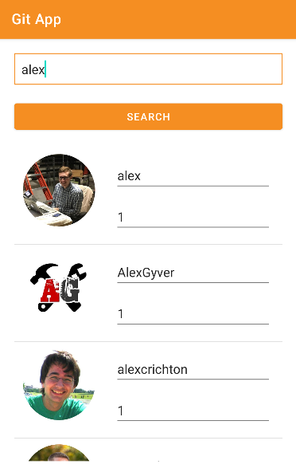
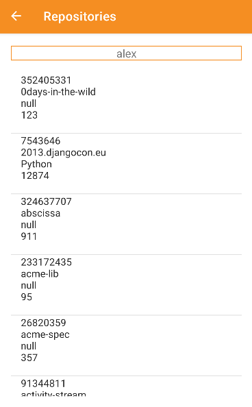

# Retrofit using github api

The main of this application it's to select the users of github and appear in the ListView

## dependecies
 `implementation 'com.squareup.retrofit2:retrofit:2.9.0'
    implementation 'com.squareup.retrofit2:converter-gson:2.9.0'
    // https://mvnrepository.com/artifact/de.hdodenhof/circleimageview
    implementation group: 'de.hdodenhof', name: 'circleimageview', version: '3.1.0'`

 ## permission
 you need to add this property to your AndroidManifest.xml
 `<uses-permission android:name="android.permission.INTERNET" />`

 ## Screens
 
 